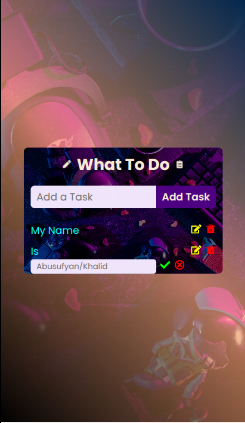
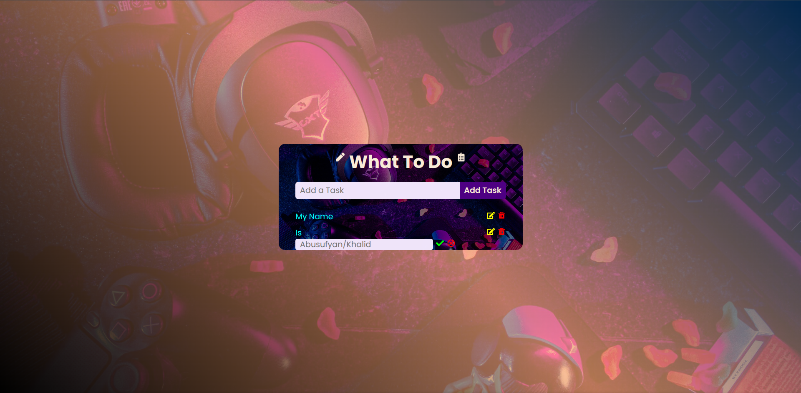

# 🚀 TO_DO_REACT

A responsive and animated To-Do web app built with **React**, **Vite**, and **CSS**.

This project allows users to manage tasks with a clean and minimal interface.  
It features subtle animations, a background image overlay, and responsive layout — all styled with vanilla CSS.  
Perfect for practicing React fundamentals, CSS tricks, and responsive design.

---

## 📦 Tech Stack

- React (with JSX/TSX)
- Vite (fast bundler)
- Plain CSS for styling
- CSS3 animations
- Media queries for responsive design

## 📁 Project Structure

src/
├── assets/
├── components/
├── CSS/
├── App.tsx
├── main.tsx
├── todo.ts
├── TodoService.ts

## 💡 Features

- Add and manage tasks
- Centered layout with Flexbox
- Background image with black transparent gradient
- Bounce animation using CSS `@keyframes`
- Responsive styles using media queries
- Custom input & button styling

---

## 📸 Screenshot

# Clone the repository

git clone https://github.com/Kalx6/TO_DO_REACT.git

# Navigate into the project folder

cd TO_DO_REACT

# Install dependencies

npm install

# Run the dev server

npm run dev
